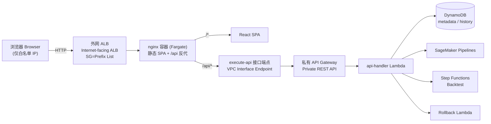
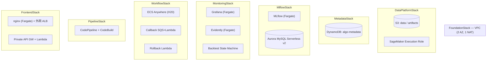

# 算法平台 · Algorithm Platform

> 面向风电 / 光伏功率预测的一体化 MLOps 平台，部署于 **AWS 中国宁夏区（cn-northwest-1，`aws-cn` 分区）**。
> A unified MLOps platform for wind & solar power‑forecasting algorithms — training, deployment, monitoring — running in **AWS China (Ningxia, `cn-northwest-1`, `aws-cn` partition)**.


---

## 2. 概述 · Overview

**中文**：算法团队要把风/光功率预测模型从开发、训练、注册、部署到线上监控串成一条可复用的流水线，但自建 MLOps 涉及 SageMaker、MLflow、监控、CI/CD 等一堆组件，且必须落在 AWS 中国区（无 CloudFront、公网访问需备案、镜像源受限）。本平台把这些能力打包成一套可一键部署的 CDK 基础设施 + 前后端应用。

**English**：Algorithm teams need one reusable pipeline that carries a forecasting model from development → training → registry → deployment → production monitoring. Rolling your own MLOps means wiring SageMaker, MLflow, monitoring and CI/CD together — and doing it inside AWS China, where CloudFront is unavailable, public web access needs ICP filing, and image/package mirrors are restricted. This platform packages all of that into one deployable CDK stack set plus a front/back application.

| | |
|---|---|
| **解决的问题 · Problem** | 缺少统一、可审计、可复现的风/光预测 MLOps 流程 / No unified, auditable, reproducible forecasting MLOps flow |
| **核心价值 · Value** | 一套 CDK 一键拉起全栈；China‑region‑native（私有 API、无公网 S3、镜像走中国源）/ One‑command full‑stack IaC, China‑region‑native by design |
| **目标用户 · Users** | 数据科学家、MLOps / 平台工程师、运维 / Data scientists, MLOps & platform engineers, operators |

---

## 3. 功能 · Features

| 功能 · Feature | 说明 · Description | 状态 · Status |
|---|---|---|
| 算法资产管理 · Algorithm registry | DynamoDB 存业务元数据，前端支持增删查改 / CRUD over DynamoDB metadata | ✅ Done |
| 工作流触发 · Pipeline trigger | 前端一键触发 SageMaker Pipeline 执行 / One‑click `StartPipelineExecution` | ✅ Done (需先创建 pipeline) |
| 实验/版本追踪 · Experiment tracking | MLflow on Fargate + Aurora MySQL | ✅ Infra ready |
| 模型监控 · Monitoring | Grafana 看板 + Evidently 漂移检测 + 每日回测 | ✅ Infra ready |
| 回测 · Backtesting | Step Functions 编排 SageMaker Processing | ✅ Trigger wired |
| 回滚 · Rollback | 一键回滚 SageMaker Endpoint | ⚙️ Skeleton |
| H20 大模型训练 · H20 GPU training | ECS Anywhere（EXTERNAL）+ SQS 回调 | ✅ Infra ready |
| MLflow 版本页接前端 · Versions UI → MLflow | 前端 Versions 页接真实 MLflow | 🗺️ Roadmap |
| ALB HTTPS / Cognito 鉴权 | TLS 与应用层鉴权 | 🗺️ Roadmap |

---

## 4. 架构 · Architecture

**访问路径（唯一公网入口）· Access path (single public entry)**



<!-- Text fallback: Browser (allowlisted IPs only) -> internet-facing ALB (SG restricted to a managed prefix list) -> nginx container on Fargate. nginx serves the SPA for '/' and reverse-proxies '/api/*' to an execute-api VPC interface endpoint -> private API Gateway -> api-handler Lambda -> DynamoDB / SageMaker / Step Functions / Rollback Lambda. There is no public API surface; the backend is only reachable in-VPC. -->

**平台组件 · Platform components**



<!-- Text fallback: 8 CDK stacks. FoundationStack = VPC (2 AZ, 1 NAT). DataPlatformStack = S3 buckets + SageMaker execution role. MetadataStack = DynamoDB metadata table. MlflowStack = MLflow on Fargate + Aurora MySQL Serverless v2. MonitoringStack = Grafana + Evidently on Fargate + backtest Step Functions. WorkflowStack = ECS Anywhere (H20) + callback SQS/Lambda + rollback Lambda. PipelineStack = CodePipeline + CodeBuild CI/CD. FrontendStack = nginx on Fargate behind an internet-facing ALB + a private API Gateway with the api-handler Lambda. -->

**技术栈 · Tech stack**

| 层 · Layer | 技术 · Technology |
|---|---|
| IaC | AWS CDK v2 (TypeScript), `aws-cn` partition |
| 前端 · Frontend | React 18 · Vite 5 · Cloudscape Design · ECharts · react-router |
| 前端托管 · Hosting | nginx 容器 (ECR) · Fargate · 外网 ALB + 托管前缀列表白名单 |
| 后端 · Backend | API Gateway (**Private**) · Lambda (Node.js 18) · api-handler 路由分发 |
| 数据 · Data | DynamoDB · Aurora MySQL (MLflow) · S3 |
| ML | SageMaker Pipelines / Processing · MLflow · Evidently |
| 编排/监控 · Orchestration | Step Functions · EventBridge · Grafana · SNS |
| CI/CD | CodeCommit · CodePipeline · CodeBuild（privileged，构建镜像）|

---

## 5. 快速开始 · Getting Started

### Prerequisites · 前置要求

| 依赖 · Requirement | 版本 · Version |
|---|---|
| Node.js | 18+ |
| Python | 3.12（容器）/ 3.11（ML 构建）|
| AWS CDK CLI | v2 (`npm i -g aws-cdk`) |
| AWS 凭证 · Credentials | 一个 `aws-cn` 账号，配置好 profile（本项目示例用 `bjs`）|
| Docker | 仅本地构建镜像时需要；**推荐用 CodeBuild 构建**（见部署）|

> ⚠️ **中国区注意 · China notes**：Docker Hub / PyPI 官方源 / 清华源 从 AWS 中国区 CodeBuild 网络**不可达或极慢**。镜像统一用 `public.ecr.aws`（官方镜像）与 `docker.m.daocloud.io`（第三方），pip 用 `mirrors.aliyun.com`，npm 用 `registry.npmmirror.com`。

### Installation · 安装

```bash
# 安装依赖 / install workspace deps
npm install

# 基础设施依赖 / infra deps
cd infrastructure && npm install && cd ..

# 前端构建产物 / build the frontend (produces frontend/dist)
cd frontend && npm run build && cd ..
```

### Configuration · 配置

`configuration/projectConfig.json`：

| 变量 · Key | 必填 · Required | 默认值 · Default | 说明 · Description |
|---|---|---|---|
| `projectName` | 是 Yes | `algo-platform` | 项目标识 / project identifier |
| `region` | 是 Yes | `cn-northwest-1` | 部署区域（宁夏）/ deploy region |
| `repoType` | 否 No | `codecommit` | 源码仓库类型 / source repo type |
| `modelEndpointExportNamePrefix` | 否 No | `AlgoModelEndpoint` | CFN 导出前缀 / CFN export prefix |

运行时环境变量 · Runtime environment variables：

| 变量 · Var | 作用域 · Scope | 必填 | 默认值 · Default | 说明 · Description |
|---|---|---|---|---|
| `CDK_DEFAULT_ACCOUNT` | CDK deploy | 自动 Auto | — | 由 `--profile` 解析 / resolved from profile |
| `VITE_API_BASE_URL` | 前端 build | 否 No | `/api` | 同源反代，通常保持默认 / same-origin, keep default |
| `PIPELINE_NAME` | api-handler Lambda | 否 No | `AlgoWindPowerPipeline` | 触发/列举的 SageMaker pipeline 名 |
| `METADATA_TABLE` | api-handler Lambda | 是 Yes | (CDK 注入) | 算法元数据表 / metadata table |
| `BACKTEST_STATE_MACHINE_ARN` | api-handler Lambda | 是 Yes | (CDK 注入) | 回测状态机 / backtest SFN |
| `SAGEMAKER_PIPELINE_ROLE_ARN` | run_pipeline.py | 是 Yes | — | SageMaker 执行角色 / exec role |
| `SAGEMAKER_ARTIFACT_BUCKET` | run_pipeline.py | 是 Yes | — | 制品桶 / artifact bucket |

### Quick Start · 最小可运行（部署全栈）

```bash
# 0) 确认账号/区域 / verify identity & region
aws sts get-caller-identity --profile bjs --region cn-northwest-1

# 1) 确认已 bootstrap（首次需 cdk bootstrap） / ensure CDK bootstrap exists
aws cloudformation describe-stacks --stack-name CDKToolkit --profile bjs --region cn-northwest-1

# 2) 合成校验（不动云资源） / synth to validate
cd infrastructure && npx cdk synth --profile bjs && cd ..

# 3) 部署（推荐用 CodeBuild，见 §8；本地需 Docker） / deploy
cd infrastructure && npx cdk deploy --all --profile bjs --require-approval never
```

部署后从 `FrontendStack` 输出取访问地址与 IP 白名单前缀列表：
```bash
aws cloudformation describe-stacks --stack-name FrontendStack --profile bjs \
  --region cn-northwest-1 --query "Stacks[0].Outputs" --output table
```

---

## 6. 使用 · Usage

**访问前端 · Access the UI**：前端只对 **白名单 IP** 开放，需把你的公网 IP 加进 ALB 的托管前缀列表：

```bash
# 查前缀列表 ID（FrontendAllowlistPrefixListId 输出） / get prefix list id from stack outputs
PL=<pl-xxxxxxxx>
MYIP=$(curl -s https://checkip.amazonaws.com.cn || curl -s ifconfig.me)
VER=$(aws ec2 describe-managed-prefix-lists --prefix-list-ids $PL \
  --region cn-northwest-1 --profile bjs --query 'PrefixLists[0].Version' --output text)
aws ec2 modify-managed-prefix-list --prefix-list-id $PL --current-version $VER \
  --add-entries "Cidr=${MYIP}/32,Description=my-ip" --region cn-northwest-1 --profile bjs
```

**API 概览 · API overview**（经 nginx 反代 `/api/*`，同源；后端为私有 API GW）：

| 方法 Method | 路径 Path | 说明 Description |
|---|---|---|
| GET | `/api/algorithms` | 列表 / list |
| POST | `/api/algorithms` | 创建 / create |
| GET/PUT/DELETE | `/api/algorithms/{id}` | 单个算法 / one algorithm |
| GET | `/api/workflows` | 流水线执行列表 / executions |
| POST | `/api/workflows` | 触发执行 / start execution |
| GET | `/api/monitoring/drift` | 漂移报告 / drift report |
| POST | `/api/monitoring/backtest` | 触发回测 / trigger backtest |
| POST | `/api/rollback` | 回滚 / rollback |

**创建 SageMaker 流水线（供 Workflows 触发用）· Create the pipeline**：

```bash
export AWS_DEFAULT_REGION=cn-northwest-1
export SAGEMAKER_PROJECT_NAME=AlgoWindPowerPipeline
export SAGEMAKER_PIPELINE_ROLE_ARN=<DataPlatformStack SageMakerExecutionRoleArn>
export SAGEMAKER_ARTIFACT_BUCKET=<DataPlatformStack SageMakerArtifactBucketName>
pip install -i https://mirrors.aliyun.com/pypi/simple/ -r ml_pipeline/requirements.txt
python ml_pipeline/run_pipeline.py
```

---

## 7. 开发 · Development

### 项目结构 · Project structure

```text
algo-platform/
├── infrastructure/     # AWS CDK (TypeScript) — 8 stacks + constructs
│   ├── bin/app.ts      # CDK app 入口 / entry
│   └── lib/{stacks,constructs}/
├── frontend/           # React + Vite + Cloudscape SPA
│   ├── src/{pages,api,layouts,components}/
│   ├── Dockerfile.nginx        # nginx 镜像（反代 /api）/ nginx image
│   └── nginx.conf.template     # envsubst 注入 API_HOST
├── lambdas/            # Lambda handlers
│   ├── api-handler/    # REST 路由分发 / BFF router
│   ├── metadata-crud/  · rollback/ · callback-handler/ · backtesting/
├── containers/         # mlflow / grafana / evidently 镜像
├── ml_pipeline/        # SageMaker pipeline 定义与执行 / pipeline.py, run_pipeline.py
├── buildspecs/         # CodeBuild specs（build/deploy/pipeline/create-pipeline）
└── configuration/projectConfig.json
```

### 编码规范 · Conventions
- TypeScript strict；前端 Cloudscape 组件；命名 camelCase(JS/TS) / snake_case(Python)。
- 提交前跑构建校验（见下）。

### 测试与构建 · Test & build

```bash
# 基础设施类型检查 / infra typecheck
cd infrastructure && npx tsc --noEmit

# 单元测试（Jest, CDK 断言 + Lambda 路由）/ unit tests
npm test

# 前端构建 / frontend build
cd frontend && npm run build
```

---

## 8. 部署 · Deployment

**推荐路径：CodeBuild（privileged）跑 `cdk deploy --all`** — 因为 MLflow/Grafana/Evidently/前端都是容器镜像资产，需在能访问中国镜像源的环境里 `docker build`。本地无 Docker 时尤其如此。

<details>
<summary><b>一次性 CodeBuild deployer 搭建 · Standalone CodeBuild deployer (click)</b></summary>

```bash
# 1) IAM 角色（信任 codebuild；内联策略：assume cdk-hnb659fds-* / ssm bootstrap / logs / 源桶）
aws iam create-role --role-name algo-platform-codebuild-deployer \
  --assume-role-policy-document file://trust.json --profile bjs
aws iam put-role-policy --role-name algo-platform-codebuild-deployer \
  --policy-name deployer-permissions --policy-document file://perms.json --profile bjs

# 2) 源桶 + 打包上传（排除 node_modules 等）
aws s3api create-bucket --bucket algo-platform-deployer-src-<acct> \
  --region cn-northwest-1 --create-bucket-configuration LocationConstraint=cn-northwest-1 --profile bjs
zip -r src.zip . -x '.git/*' 'node_modules/*' '*/node_modules/*' 'infrastructure/cdk.out/*' 'frontend/dist/*'
aws s3 cp src.zip s3://algo-platform-deployer-src-<acct>/source.zip --profile bjs

# 3) 创建 privileged 项目（buildspec=buildspecs/deploy-all.yml）并触发
aws codebuild create-project --cli-input-json file://project.json --region cn-northwest-1 --profile bjs
aws codebuild start-build --project-name algo-platform-deployer --region cn-northwest-1 --profile bjs
```
`buildspecs/deploy-all.yml` 内：`npm ci` → 构建前端 → `cdk deploy --all`（在 privileged 容器里构建并推送镜像到 ECR）。
</details>

**CI/CD**：`PipelineStack` 提供 CodeCommit → CodePipeline（Source → CI Build → MLPipeline → 人工审批 → Deploy）。生产部署走人工审批门控。

**环境区分 · Environments**：trunk‑based；以 tag / 部署配置区分 dev/staging/prod，不用长期分支。

---

## 9. API Reference

见 §6 API 概览；完整路由定义见 `lambdas/api-handler/index.ts`。后端为 **私有 API Gateway**，仅可经 VPC 内 nginx 反代访问，无公网面。

See §6; full route table in `lambdas/api-handler/index.ts`. The API is a **private** API Gateway, reachable only via the in‑VPC nginx proxy — no public surface.

---

## 10. 贡献 · Contributing

```text
Fork → feature 分支（1-2 天短生命周期）→ PR → squash-merge 到 main
```
- Commit 规范：`<type>(<scope>): <subject>`（如 `feat(frontend): wire algorithms API`）。
- PR 需通过 `tsc --noEmit` + `npm test` + 前端构建。

---

## 11. 常见问题 · Troubleshooting / FAQ

<details>
<summary><b>前端 403 Forbidden</b></summary>

网站/ALB 拒绝访问：确认你的公网 IP 已加入 ALB 前缀列表（§6）。S3 静态网站端点在中国区需 ICP 备案——本平台已改为 nginx 容器托管，不使用 S3 website 端点。
</details>

<details>
<summary><b>Workflows 页 500 / "Pipeline does not exist"</b></summary>

SageMaker 流水线尚未创建。执行 §6 的 `run_pipeline.py` 创建 `AlgoWindPowerPipeline` 后，触发即返回 202。
</details>

<details>
<summary><b>CodeBuild 卡在 npm install / pip install</b></summary>

用中国源：npm `registry.npmmirror.com`（如遇 `electron-to-chromium` 精确版本 404，构建时删 `package-lock.json` 重解析）；pip `mirrors.aliyun.com`（清华/CERNET 从 CodeBuild 不可达）。
</details>

<details>
<summary><b>Aurora 版本不可用 / Cannot find version …aurora…</b></summary>

引擎版本按区域供应。用 `rds.AuroraMysqlEngineVersion.of('8.0.mysql_aurora.3.08.2','8.0')` 指定宁夏区确有的版本。
</details>

---

## 12. Changelog

见 `CHANGELOG.md`（如缺失则参考 git 历史）。近期：去除 `goldwind` 标识符统一为 `algo`；前端 CloudFront→S3→**nginx 容器 + 外网 ALB**；后端改 **私有 API GW + nginx 反代**；中国镜像源适配；Algorithms CRUD / Workflows 触发 / Backtesting / Drift 接入真实 API。

---

## 13. License

Proprietary（内部项目）。如需开源许可请补充 `LICENSE` 文件并在此声明类型与链接。

---

## 14. 致谢 · Acknowledgements

AWS CDK · Cloudscape Design System · React · Vite · ECharts · MLflow · Evidently · Grafana · SageMaker。感谢所有贡献者。
